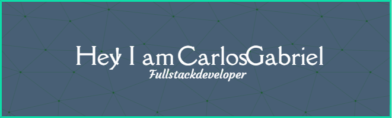

### Backend developer
#### English
* I'm living in Recife
* My portfolio is under construction, but you can see my [GitHub](https://github.com/GabrielCarlosG) or my [Website](https://www.cgtech.tec.br/) 
* Take a look at my [Linkedin](https://www.linkedin.com/in/carlos-amorim27/) too.
* I am studying systems analysis and development.
* I love Python!

#### Português
* Moro em Recife
* Meu  portfolio está em construção, porém você pode ver meu [GitHub](https://github.com/GabrielCarlosG) or my [Site](https://www.cgtech.tec.br/) 
* Dá uma olhadinha no meu [Linkedin](https://www.linkedin.com/in/carlos-amorim27/) também.
* Estou cursando Análise e Desenvolvimento de Sistemas.
* Amo Python!

### Skills

   <a href="https://github.com/GabrielCarlosG">
   
   

<table><tr>

### Frontend  

  
  
  
  
  

</tr><tr>

### Backend  

  
  
  
  
  
  
  

</tr></table>  

   
   
### Social

   
<!--
Patreon futuramente = https://www.patreon.com/c/CarlosGabriel447
**GabrielCarlosG/GabrielCarlosG** is a ✨ _special_ ✨ repository because its `README.md` (this file) appears on your GitHub profile.

Here are some ideas to get you started:

- 🔭 I’m currently working on ...
- 🌱 I’m currently learning ...
- 👯 I’m looking to collaborate on ...
- 🤔 I’m looking for help with ...
- 💬 Ask me about ...
- 📫 How to reach me: ...
- 😄 Pronouns: ...
- ⚡ Fun fact: ...
-->
